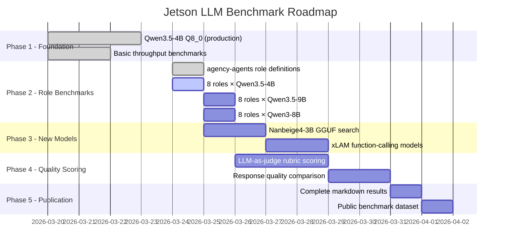

# Test Roadmap

> Progressive benchmark plan for Jetson Orin Nano Super LLM testing

## Phase Overview

## Phase 1: Foundation ✅ Complete

**Goal**: Establish baseline performance for the production model.

| Task | Status | Result |
|------|--------|--------|
| Deploy Qwen3.5-4B Q8_0 | ✅ Done | 10.5 tok/s gen, 257 tok/s prompt |
| Deploy Qwen3.5-9B Q4_K_M | ✅ Done | 8.8 tok/s gen, 195 tok/s prompt |
| Measure power/thermal | ✅ Done | 8W idle, ~15W gen, 62°C sustained |
| Validate memory math | ✅ Done | 69% bandwidth efficiency confirmed |
| Model tier system | ✅ Done | T1-T4 classification |

## Phase 2: Role Benchmarks 🔄 In Progress

**Goal**: Test each model against all 8 agency-agents roles.

### Models to Test
| Model | GGUF | Status |
|-------|------|--------|
| Qwen3.5-4B Q8_0 | 4.48 GB | 🔄 Benchmarking now |
| Qwen3.5-9B Q4_K_M | 5.3 GB | ⏳ Queued |
| Qwen3-8B Q5_K_M | 5.5 GB | ⏳ Queued |

### Roles to Test (per model)
| Role | Tasks | Status |
|------|-------|--------|
| 🖥️ Frontend Developer | 3 | 🔄 |
| 🏗️ Backend Architect | 3 | ⏳ |
| 👁️ Code Reviewer | 3 | ⏳ |
| 🔒 Security Engineer | 3 | ⏳ |
| 📚 Technical Writer | 3 | ⏳ |
| 🤖 AI Engineer | 3 | ⏳ |
| ⏱️ Performance Benchmarker | 3 | ⏳ |
| 🔌 API Tester | 3 | ⏳ |

**Total**: 8 roles × 3 tasks × 3 models = **72 benchmark runs**

## Phase 3: New Models

**Goal**: Test promising models not yet on the Jetson.

### Priority Candidates

| Model | BFCL v4 | Why | Blocker |
|-------|---------|-----|---------|
| **Nanbeige4-3B-Thinking** | 51.37 | Highest BFCL at 3B, predicted 13.4 tok/s | GGUF availability unknown |
| **xLAM-2-8b-fc-r** | 46.68 | Function-calling specialist, 92% parallel FC | Need GGUF conversion |
| **Hammer-4B** | 45.37 | Tool-calling focused, fits in T1 | GGUF availability |

### Model Discovery Checklist
- [ ] Search HuggingFace for Nanbeige4-3B GGUF
- [ ] Check bartowski/unsloth/TheBloke for pre-made GGUFs
- [ ] Evaluate xLAM GGUF options
- [ ] Download and test top candidate

## Phase 4: Quality Scoring

**Goal**: Move beyond tok/s to measure response quality.

### Scoring Approach
1. **Automated regex checks**: Does the response contain expected elements?
   - Code blocks present for coding tasks
   - Table format for structured output requests
   - Error identification for review tasks
2. **LLM-as-judge**: Use a capable model to grade responses against rubrics
   - Each task has a 5-dimension rubric (see [agent-roles.json](data/agent-roles.json))
   - Weights: correctness (30-40%), completeness (25%), quality (15-20%), robustness (10-15%), docs (10%)
3. **Statistical rigor**: 3 runs per task, report median score

### Quality Dimensions
| Dimension | Weight | What It Measures |
|-----------|--------|-----------------|
| Correctness | 30-40% | Does it work? Is it right? |
| Completeness | 25% | Are all requirements addressed? |
| Code Quality | 15-20% | Is it idiomatic, typed, clean? |
| Robustness | 10-15% | Edge cases, error handling? |
| Documentation | 5-10% | Examples, explanations, comments? |

## Phase 5: Publication

**Goal**: Make all results publicly available and reproducible.

- [ ] Complete benchmark result tables in BENCHMARKS.md
- [ ] Per-model response files in results/ directory
- [ ] Reproducibility guide (exact commands to replicate)
- [ ] CSV/JSON export of all measurements
- [ ] Comparison charts (GitHub-compatible Mermaid)

## How to Contribute

Want to add a model or role to the benchmark suite?

1. **New model**: Add entry to `data/jetson-models.json`, download GGUF to Jetson, run benchmark
2. **New role**: Copy from [agency-agents](https://github.com/msitarzewski/agency-agents), add to `data/agent-roles.json` with 3 tasks
3. **Quality scores**: Help build the LLM-as-judge scoring pipeline

See [CONTRIBUTING.md](CONTRIBUTING.md) for details.

---

*Roadmap reflects current state as of benchmarking. Some phases may run in parallel.*
